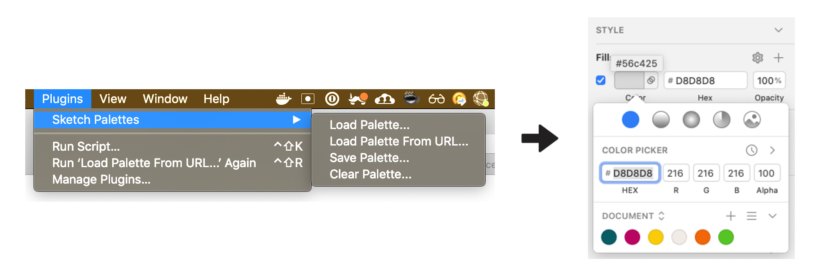

# Sketch Palettes

A Sketch plugin for exporting and importing fill presets. It supports colors, gradients, and Pattern fills.

# Installation

Move the Sketch Palettes plugin into your Plugins folder or double-click the .sketchplugin file.

# Usage

#### Saving Palettes

You can save palettes from either the Global presets section or from the Document presets section of the color picker. You can also select which of the available fill types you'd like to include. The plugin supports colors, gradients, and pattern fills. Saving will create a .sketchpalette file at whatever location you choose.

#### Loading Palettes

Running the "Load Palette..." command in the plugin menu will allow you to choose a .sketchpalette file containg the presets you like to import. You can load palettes into either the Global presets section or into the Document presets section of the color picker. You can also select which of the available fill types you'd like to load. Fill presets will then be appended to the corresponding preset sections.

#### Removing Palettes

Select "Clear Palette..." to remove fill presets from either the Global presets or Document presets section of the color picker. You can select which fill types you'd like to clear.

# Info & Feedback

This plugin would not have been possible without the help of some other awesome people. <a href="https://github.com/alandickinson" target="_blank">Alan Dickinson</a> was enormously helpful and implemented the long-standing feature request to support gradients, as well as some other nice enhancements and bug fixes. <a href="https://twitter.com/wbobeirne" target="_blank">William O'Beirne</a> helped with some of the trickier parts earlier on, like making sense of the <a href="http://stevenygard.com/projects/class-dump/" target="_blank">class-dump</a> of Sketch, to figure out how to use undocumented Sketch functionality. And <a href="https://github.com/bomberstudios" target="_blank">Ale Muñoz</a> lent a hand fixing bugs here and there.

If you have any questions, find a bug, or have ideas for ways to improve the plugin, ping me on twitter: <a href="https://twitter.com/AndrewFiorillo" target="_blank">@andrewfiorillo</a>