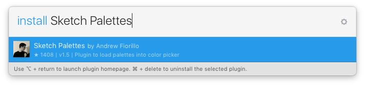

# Sketch Palettes

A Sketch plugin that lets you save and load colors into the color picker.

# Installation

Move the Sketch Palettes plugin into your Plugins folder. You can get access to that folder by opening the Plugins menu, and choosing "Reveal Plugins Folder..."

## Install with Sketch Runner
With Sketch Runner, just go to the `install` command and search for `Sketch Palettes`. Runner allows you to manage plugins and do much more to speed up your workflow in Sketch. [Download Runner here](http://www.sketchrunner.com).

# Usage

#### Saving Palettes

You can save color palettes from either the Global Colors section of the color picker or from the Document Colors section. Selecting "Save Palette..." in either menu will save those colors as a .sketchpalette file to whatever location you choose.

#### Loading Palettes

You can load colors into either the Global Colors section of the color picker or into the Document Colors section. Selecting "Load Palette..." from either menu will prompt you to open a .sketchpalette file containing the colors you want to load. Colors will then be appended to the corresponding color picker section.

#### Removing Palettes

Select "Clear Palette" to remove all colors from either the Global Colors section of the color picker or from the Document Colors section.

# Info & Feedback

If you have any questions, find a bug, or have ideas for ways to improve the plugin, ping me on twitter: <a href="https://twitter.com/AndrewFiorillo" target="_blank">@andrewfiorillo</a>

Also, big thanks to <a href="https://twitter.com/wbobeirne" target="_blank">William O'Beirne</a> for helping me with some of the trickier parts, like making sense of the <a href="http://stevenygard.com/projects/class-dump/" target="_blank">class-dump</a> of Sketch, to figure out how to use undocumented Sketch functionality.
